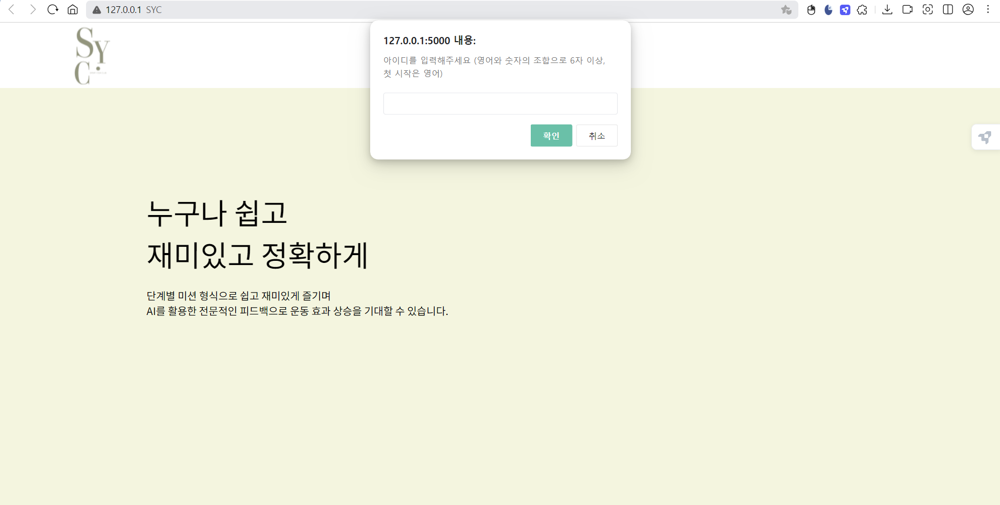
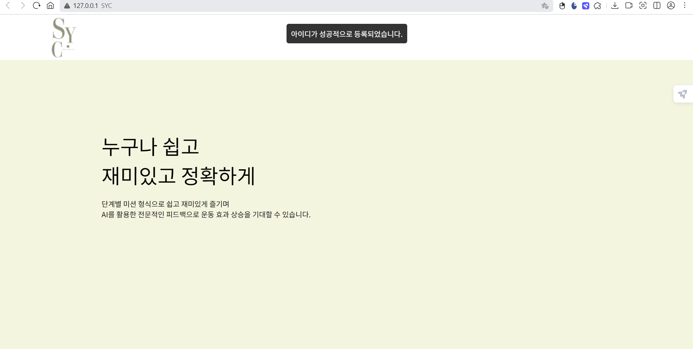
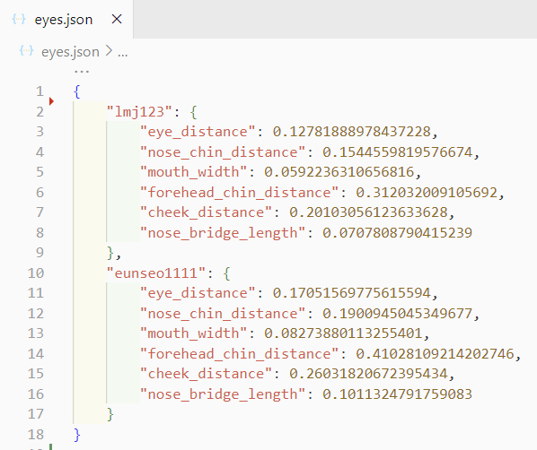
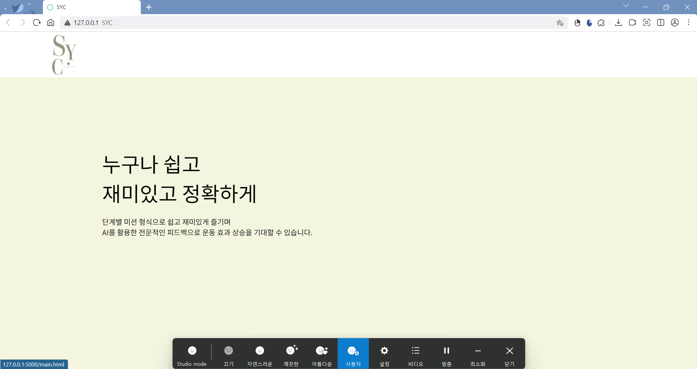
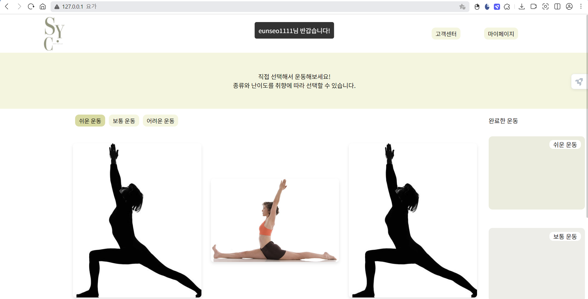
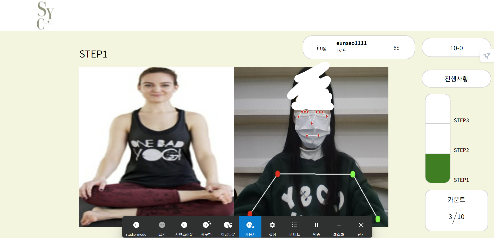

# 스요클(스마트 요가 클럽)
AI를 활용하여 자세 교정 및 재활에 도움을 주고, 최신 동향인 헬시플레저(건강과 기쁨의 합성어로, 건강을 즐겁게 관리한다라는 의미)로 지속 가능한 건강 관리를 도모하는 요가 게임 시스템

## 주요 기능
- AI 기술을 기반한 자세 교정으로 정확도 향상
- 얼굴 인식으로 인한 편한 로그인
- 카메라로 운동하는 사용자를 촬영해 모니터로 실시간 피드백 제공
- 운동 기록 저장 및 분석 시스템

## [finger_flask.py](https://github.com/2024-four-leaf-clover/Face-recognition-and-pose-detection/blob/main/finger_flask.py)
`finger_flask.py`는 `Flask`를 이용해 얼굴 및 자세 인식, 손 제스처 감지 기능을 제공하는 웹 애플리케이션을 설정한다. `OpenCV`와 `MediaPipe`를 통해 웹캠에서 얼굴 및 손 인식을 처리하며, 특정 제스처에 따라 회원가입(얼굴 등록)과 로그인(얼굴 인식)을 수행한다.

**(1) **
- 사용자 애플리케이션 실행 시
    - 브라우저에서 `/video_feed` 경로로 요청 전송
    - `Flask` 서버: 웹캠을 통해 실시간으로 손동작 인식하는 비디오 스트림 제공

**(2) **
- 웹캠에서 받은 영상 데이터 `OpenCV` 통해 프레임 단위로 처리
- `MediaPipe` 손 인식 모델(`hands`) 사용해 손의 랜드마크(관절 좌표) 감지
    - 각 손가락이 펼쳐져 있는지, 구부려져 있는지 좌표 비교로 확인
    - ex. 검지 손가락의 끝이 중간 관절보다 위에 있으면 손가락이 펴져 있다고 판단

**(3) **
- 검지 손가락만 펼쳤을 때  동작 인식
    - 사용자 등록 로직 실행
    - 웹캠에서 얼굴을 캡처하여 `MediaPipe` 얼굴 인식 모델로 얼굴 랜드마크(점) 추출
    - 얼굴 데이터는 `eyes.json` 파일에 저장되고, 사용자 정보로 등록
    - 등록 완료되면 JSON 파일에 사용자 얼굴 데이터 추가되며, 등록 메시지 반환

**(4) **
- 검지와 중지 손가락만 펼쳤을 때  동작 인식
    - 사용자 로그인 로직 실행
    - 웹캠에서 현재 사용자의 얼굴을 인식하고, 저장된 얼굴 데이터(`eyes.json`)와 비교
    - 일치하는 얼굴 데이터 있으면 로그인 성공(`yoga.html`로 이동), 그렇지 않으면 실패 메시지 반환

**(5)  수행 로직**
- 사용자가 로그인에 성공하면 `yoga.html`로 이동
    - 로그인 성공 시, `user_id`가 쿼리 파라미터로 전달
    - `user_id`는 사용자가 어떤 요가 자세를 수행했는지 확인하기 위해 사용
    - 요가 자세 분석을 위해, 요가 이미지를 `OpenCV`로 불러오고, `MediaPipe`의 자세 인식 모델을 사용해 이미지에서 포즈(랜드마크)를 추출
    - 추출된 포즈 랜드마크: 사용자가 수행한 자세와 비교하는 기준 자세로 사용

**(6)  수행 로직**
- `game.html`로 이동해서 요가 자세 수행
    - 
    - : 사용자의 관절 각도를 기준 자세와 비교해, 올바른 자세를 취하고 있는지 판단

||사진|
|:---:|:---:|
|**아이디 입력**||
|**아이디 저장**||
|**얼굴 정보 저장**||
|**로그인 시도**||
|**로그인 성공**||
|**자세 인식**||

## 그 외

### [stt_flask.py](https://github.com/2024-four-leaf-clover/Face-recognition-and-pose-detection/blob/main/stt_flask.py)
`stt_flask.pyy`는 `Flask`와 `Mediapipe`, `OpenCV`를 사용해 음성 인식으로 회원가입와 로그인 기능을 처리한다. 또한 웹캠을 활용해 얼굴 및 자세 인식을 수행한다.

### [app.py](https://github.com/2024-four-leaf-clover/Face-recognition-and-pose-detection/blob/main/merge/app.py)
`app.py`는 `Flask` 웹 프레임워크를 이용해 웹 서버를 만들고, 웹캠을 통해 손동작 및 얼굴 인식을 수행하는 로직을 포함한다. `MediaPipe` 라이브러리를 활용해 손동작과 얼굴을 감지하며, 이를 통해 회원가입 또는 로그인 동작을 수행한다. `main.html`에 `main.js`를 연결한다.

### [posture_flask.py](https://github.com/2024-four-leaf-clover/Face-recognition-and-pose-detection/blob/main/merge/posture_flask.py)
`posture_flask.py`는 `Flask `웹 프레임워크를 사용하여 오가 자세 인식을 수행하는 웹 애플리케이션을 구축한다. `MediaPipe` 라이브러리를 사용해 웹캠으로 사용자의 요가 자세를 인식하고, 미리 로드한 표준 요가 자세 이미지와 비교하여 인식 결과를 제공한다. `main.html`에 `main_stt.js`를 연결한다.

### [merge_flask.py](https://github.com/2024-four-leaf-clover/Face-recognition-and-pose-detection/blob/main/merge_flask.py)
`app.py`와 `posture_flask.py`를 결합한 파일
