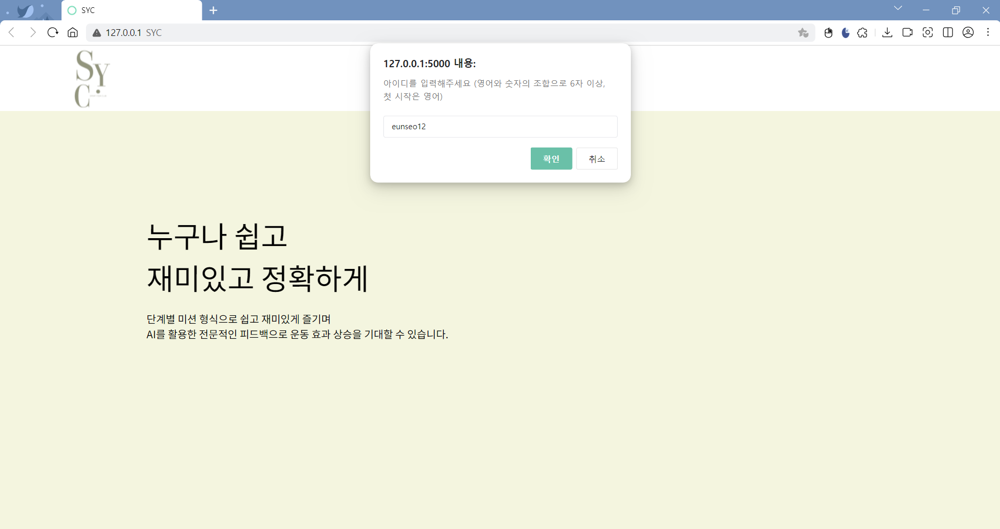
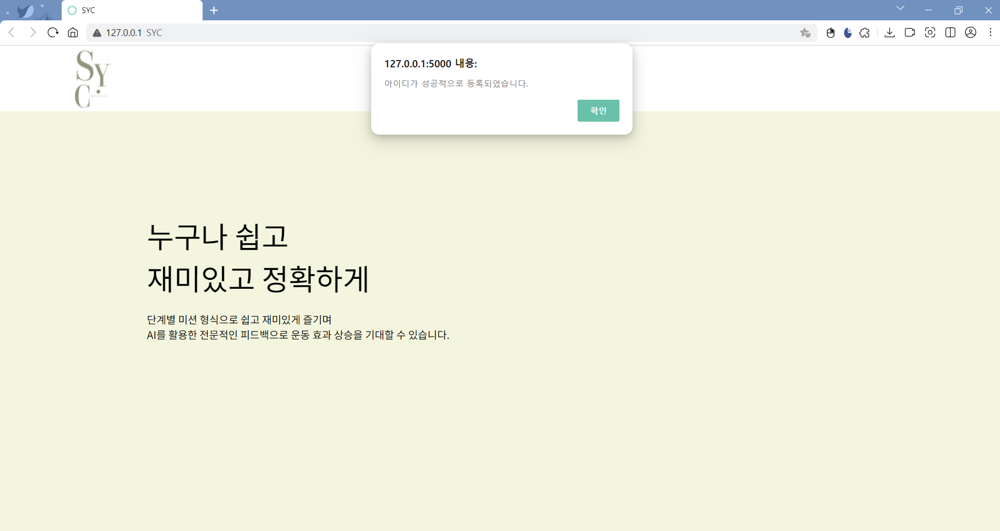
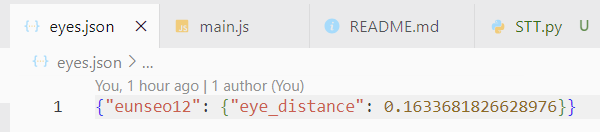

# 스요클(스마트 요가 클럽)
AI를 활용하여 자세 교정 및 재활에 도움을 주고, 최신 동향인 헬시플레저(건강과 기쁨의 합성어로, 건강을 즐겁게 관리한다라는 의미)로 지속 가능한 건강 관리를 도모하는 요가 게임 시스템

## 주요 기능
- AI 기술을 기반한 자세 교정으로 정확도 향상
- 얼굴 인식으로 인한 편한 로그인
- 카메라로 운동하는 사용자를 촬영해 모니터로 실시간 피드백 제공
- 운동 기록 저장 및 분석 시스템

## [app.py](https://github.com/2024-four-leaf-clover/Face-recognition-and-pose-detection/blob/main/app.py)
`app.py`는 `Flask` 웹 프레임워크를 이용해 웹 서버를 만들고, 웹캠을 통해 손동작 및 얼굴 인식을 수행하는 로직을 포함한다. `MediaPipe` 라이브러리를 활용해 손동작과 얼굴을 감지하며, 이를 통해 회원가입 또는 로그인 동작을 수행한다.

## [posture_flask.py](https://github.com/2024-four-leaf-clover/Face-recognition-and-pose-detection/blob/main/posture_flask.py)
`posture_flask.py`는 `Flask `웹 프레임워크를 사용하여 오가 자세 인식을 수행하는 웹 애플리케이션을 구축한다. `MediaPipe` 라이브러리를 사용해 웹캠으로 사용자의 요가 자세를 인식하고, 미리 로드한 표준 요가 자세 이미지와 비교하여 인식 결과를 제공한다.

## [merge_flask.py](https://github.com/2024-four-leaf-clover/Face-recognition-and-pose-detection/blob/main/merge_flask.py)
`app.py`와 `posture_flask.py`를 결합한 파일

**(1) 회원가입과 로그인**
- 손동작에 따라 Python 로직 다르게 수행
    - 검지만 펼쳐졌을 때: 회원가입(`register`) 동작 수행
    - 검지와 중지만 펼쳐졌을 때: 로그인(`login`) 동작 수행
- 회원가입 시, `main.js`에서 프롬프트로 입력된 아이디와 촬영한 얼굴 정보를 Python이 `eyes.json`에 저장
- 로그인 시, 촬영된 얼굴 정보가 `eyes.json`에 저장된 값과 비교되어 인증을 진행

||사진|
|---|---|
|아이디 입력||
|아이디 저장||
|얼굴 정보 저장||

